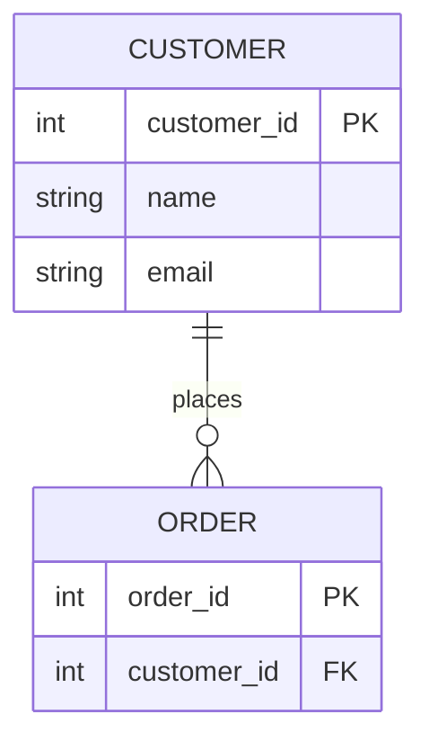

## 概要

ER図（Entity-Relationship Diagram）は、データベースの構造をエンティティ（実体）、属性、関連（リレーションシップ）で視覚的に表現するモデリング手法。1976年に Peter Chen が提唱し、現在もデータベース設計の基本ツールとして広く使われている。

## 詳細

### 歴史

Peter Chen（陳品山）が 1975年の第1回 VLDB 国際会議で初発表し、1976年に ACM Transactions on Database Systems に "The Entity-Relationship Model: Toward a Unified View of Data" として掲載された。Codd のリレーショナルモデルとは異なるアプローチとして提案され、後に Codd 自身が RM/T モデルに ER の概念を取り込んだ。

### 核心概念

- **エンティティ（Entity）**: 現実世界の「もの」（人、物、概念）
- **属性（Attribute）**: エンティティの特性・プロパティ
- **関連（Relationship）**: エンティティ間の関係
- **カーディナリティ**: 1:1, 1:N, M:N の多重度
- **主キー（PK）・外部キー（FK）**: エンティティの識別と関連の実装手段

### 表記法の比較

| 表記法 | エンティティ | 属性 | 関連 | 主な用途 |
|---|---|---|---|---|
| **Chen 記法** | 長方形 | 楕円形 | 菱形 | 教育・概念設計・非技術者向け |
| **Crow's Foot（IE 記法）** | 属性を含む長方形 | 表内列 | 鳥の足記号 | 商業設計・最も普及 |
| **IDEF1X** | 技術的な長方形 | 表内列 | 厳密な記号 | 政府・金融等の規制産業 |
| **UML クラス図** | クラスボックス | クラス内属性 | 多重度表記 | OOP とDB統合設計 |

### 3段階の ER 図

| 段階 | 目的 | 内容 |
|---|---|---|
| **概念 ER 図（Conceptual）** | ビジネス要件整理・ステークホルダー合意 | 主要エンティティと関係のみ。実装詳細なし |
| **論理 ER 図（Logical）** | データ構造の詳細設計 | 全属性・PK/FK・正規化済み・DBMS 非依存 |
| **物理 ER 図（Physical）** | DBMS への実装設計 | データ型・インデックス・パーティション・ストレージ設定 |

概念 → 論理 → 物理の順で段階的に設計するのが基本。いきなり物理設計から始めないこと。

### 正規化との関係

論理 ER 図の設計プロセスで正規化を同時に行う。1NF → 2NF → 3NF（第3正規形）が標準的な目標:

- **1NF**: 繰り返しグループを排除し、属性の原子性を保つ
- **2NF**: 部分関数従属を排除
- **3NF**: 推移関数従属を排除

目的はデータ冗長の排除・更新異常の防止・整合性の確保。

### 最新ツール（2025-2026）

| ツール | 特徴 |
|---|---|
| [Mermaid](https://mermaid.js.org/syntax/entityRelationshipDiagram.html) | テキストベース・OSS・Crow's Foot 記法・GitHub/GitLab 自動レンダリング |
| [dbdiagram.io](https://dbdiagram.io/home) | DBML（独自 DSL）・SQL import/export・無料10図 |
| [draw.io](https://app.diagrams.net/) | GUI ベース・無料・VS Code 拡張あり |
| [ERDPlus](https://erdplus.com/) | 教育向け無料・Chen/UML/リレーショナルスキーマ対応 |
| [ChartDB](https://chartdb.io/) | DB スキーマビジュアライザー・OSS |
| [Mermaid Chart](https://mermaid.ai/) | Mermaid の SaaS 版・Visual ERD Editor・AI アシスト |

#### Mermaid ERD の記法例



- `||--o{` = 1 対 0以上
- `||--|{` = 1 対 1以上（必須）
- `}|..|{` = 非識別関連（破線）

#### DBML の記法例（dbdiagram.io）

```dbml
Table users {
  id integer [primary key]
  username varchar
  email varchar
}
Table orders {
  id integer [primary key]
  user_id integer [ref: > users.id]
}
```

### Schema-as-Code の潮流

- DBML ファイルを `.dbml` として Git 管理
- Mermaid を Markdown に埋め込み → GitHub/GitLab で自動レンダリング
- Prisma Schema, SQLAlchemy モデル等のコードから ER 図を自動生成するツールが増加
- 自然言語 → AI が ER 図を自動生成する手法も登場（Mermaid Chart, Eraser.io 等）

### よくある失敗

- 概念設計をスキップして物理設計から始める
- 正規化不足による冗長データ（更新・削除異常）
- 過剰な正規化によるクエリパフォーマンス低下
- エンティティと属性の混同（例: 「住所」をエンティティにすべきか属性にすべきか）
- カーディナリティの誤記（1:N と M:N の混同）
- M:N 関連を中間テーブルで解決し忘れる

## ポイント

- 1976年の Peter Chen の提案以来、データベース設計の基本手法として定着
- Crow's Foot（IE）記法が商業・実務で最も普及。教育では Chen 記法も重要
- 概念 → 論理 → 物理の3段階で段階的に設計するのがベストプラクティス
- Mermaid / DBML による Schema-as-Code が主流に。Git 管理・CI 統合・AI 生成が可能
- 正規化は論理 ER 図設計と同時に行い、3NF を標準目標とする

## 関連項目

- [[設計]] - ソフトウェア設計全般
- [[データアーキテクチャ]] - データ基盤の全体設計
- [[データベース正規化]] - 正規化理論

## 参考

- [The Entity-Relationship Model - Peter Chen (1976)](https://dl.acm.org/doi/abs/10.1145/320434.320440)
- [Peter Chen 論文 PDF (LSU)](https://www.csc.lsu.edu/~chen/pdf/erd-5-pages.pdf)
- [Entity-relationship model - Wikipedia](https://en.wikipedia.org/wiki/Entity%E2%80%93relationship_model)
- [Crow's Foot vs Chen notation - Gleek](https://www.gleek.io/blog/crows-foot-chen)
- [Mermaid ERD 公式ドキュメント](https://mermaid.js.org/syntax/entityRelationshipDiagram.html)
- [DBML 公式ドキュメント](https://dbml.dbdiagram.io/home/)
- [dbdiagram.io](https://dbdiagram.io/home)
