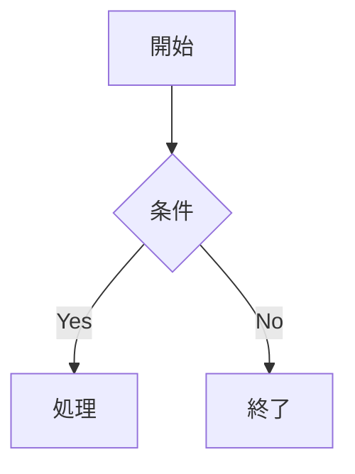

## 概要

Slidev は開発者向けのプレゼンテーションツールで、Markdown と Vue コンポーネントを組み合わせてスライドを作成する。Vite による高速な HMR（ホットリロード）・Monaco エディタでのライブコーディング・UnoCSS によるスタイリングを特徴とし、37,000 以上の GitHub スターを持つ人気 OSS プロジェクト。

## 詳細

### 基本情報

| 項目 | 内容 |
|------|------|
| 開発者 | Anthony Fu |
| 言語 | Vue 3 + Vite + TypeScript |
| ライセンス | MIT |
| 公式サイト | sli.dev |
| GitHub | github.com/slidevjs/slidev |
| GitHub Stars | 37,800 以上（2026年時点） |

### 特徴

Slidev は「開発者が自分のプレゼン環境を作る」というコンセプト。PowerPoint/Keynote を使わず、すべてのスライドをコードで表現し、バージョン管理・再利用・ライブデモが自然に行える。

### スライドの書き方

`slides.md` に Markdown で記述し、`---` でページを分割する：

```markdown
---
theme: seriph
highlighter: shiki
transition: slide-left
---

# Hello Slidev!

発表者: 山田太郎

---
layout: two-cols
---

# 左カラム

- ポイント 1
- ポイント 2

::right::

# 右カラム

```python
def hello():
    print("Hello!")
```
```

### フロントマター設定

```yaml
---
theme: seriph          # テーマ
highlighter: shiki     # シンタックスハイライト
lineNumbers: true      # コード行番号
drawings:
  persist: false       # 描画の永続化
transition: slide-left # スライドトランジション
---
```

### 主要機能

#### ライブコーディング（Monaco Editor）

スライド内で VS Code と同等の機能を持つエディタが動く。プレゼン中にコードを書いて実行結果をリアルタイムに見せられる。

```markdown
```ts {monaco}
const greeting = (name: string) => `Hello, ${name}!`
console.log(greeting('Slidev'))
```
```

#### Vue コンポーネントの埋め込み

`components/` ディレクトリにコンポーネントを置くだけで自動インポートされる。

```markdown
<!-- MyChart.vue という Vue コンポーネントを直接使用 -->
<MyChart :data="[10, 20, 30]" />
```

インタラクティブなデモ・グラフ・カウンターなどをスライドに埋め込める。

#### レイアウトシステム

組み込みレイアウトが多数用意されている：

| レイアウト | 説明 |
|-----------|------|
| `default` | 標準レイアウト |
| `two-cols` | 2カラムレイアウト |
| `center` | 中央揃え |
| `image-right` | 右に画像 |
| `fact` | 大きなテキスト + 説明 |
| `quote` | 引用スタイル |
| `intro` | タイトルスライド |

#### UnoCSS によるスタイリング

```markdown
<div class="text-4xl text-blue-500 font-bold">
  スタイル付きテキスト
</div>
```

Tailwind CSS ライクなユーティリティクラスで直接スタイルを適用。

#### アニメーション

```markdown
# アニメーション

<v-click>

- クリックで順番に表示

</v-click>

<v-clicks>

- 項目 1
- 項目 2
- 項目 3

</v-clicks>
```

#### Mermaid / LaTeX サポート

```markdown
$$
\int_{-\infty}^{\infty} e^{-x^2} dx = \sqrt{\pi}
$$
```



### 開発・エクスポート

```bash
# インストール・起動
npm init slidev@latest

# 開発サーバー起動（ホットリロード）
npm run dev

# PDF エクスポート
npm run export

# PPTX エクスポート
npm run export -- --format pptx

# SPA ビルド（Web 公開用）
npm run build
```

### テーマ

多数のコミュニティテーマが利用可能：

```bash
# テーマのインストール
npm install @slidev/theme-seriph

# 使用
---
theme: seriph
---
```

公式テーマ: `default`, `seriph`, `bricks`, `apple-basic` など。

### 録画・カメラ機能

プレゼン画面を録画しながら発表者カメラ映像をオーバーレイで表示できる。配信やレコーディングに便利。

### Marp との比較

| 観点 | Slidev | [[Marp]] |
|------|--------|---------|
| 対象ユーザー | フロントエンド開発者 | 全開発者・技術者 |
| インタラクティブ性 | 高（Vue コンポーネント） | 低（静的） |
| ライブコーディング | ◎ | ✗ |
| 学習コスト | 中（Vue/Vite の知識が役立つ） | 低（Markdown のみ） |
| カスタマイズ | ◎（Vue + UnoCSS） | ○（CSS テーマ） |
| 出力 | HTML/PDF/PPTX/SPA | HTML/PDF/PPTX |

## ポイント

- Vue コンポーネントをスライドに埋め込めるため、インタラクティブなデモが自在
- Monaco エディタでライブコーディングをスライド内でデモできる
- Vite の HMR でスライド変更が即時反映
- UnoCSS でスタイルを直接 Markdown に書けるため PowerPoint 不要
- SPA ビルドで Web に公開も可能

## 関連項目

- [[Marp]] - よりシンプルな Markdown スライドツール（CSS テーマ、静的出力）
- [[API]] - Slidev は Vite プラグイン API で拡張可能

## 参考

- [Slidev 公式サイト](https://sli.dev/)
- [GitHub - slidevjs/slidev](https://github.com/slidevjs/slidev)
- [Why Slidev? - Slidev Docs](https://sli.dev/guide/why)
